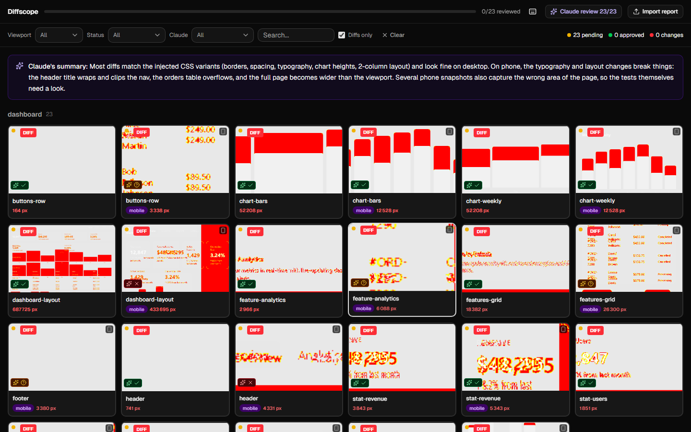
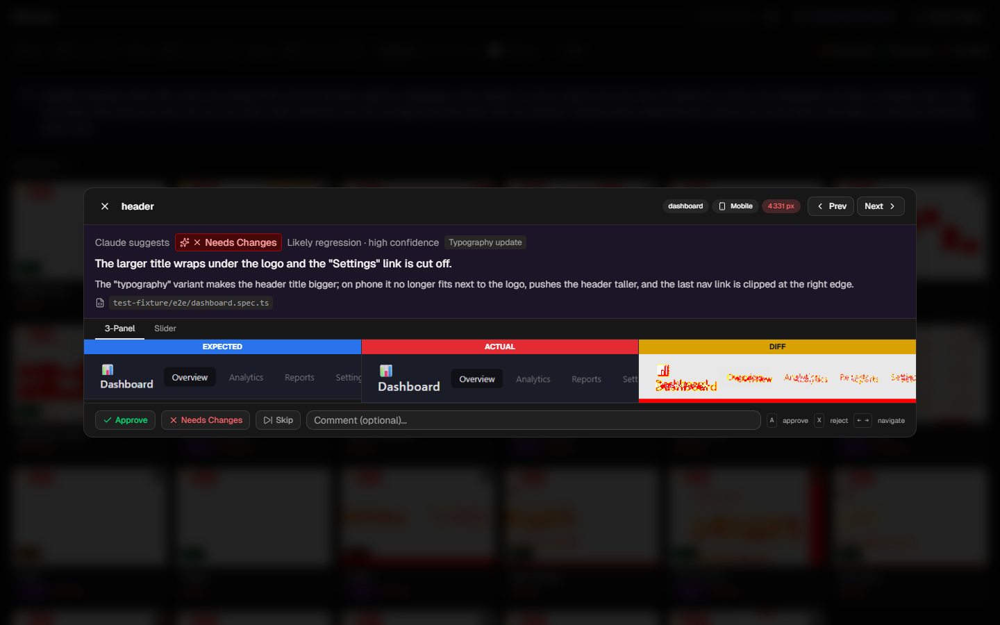
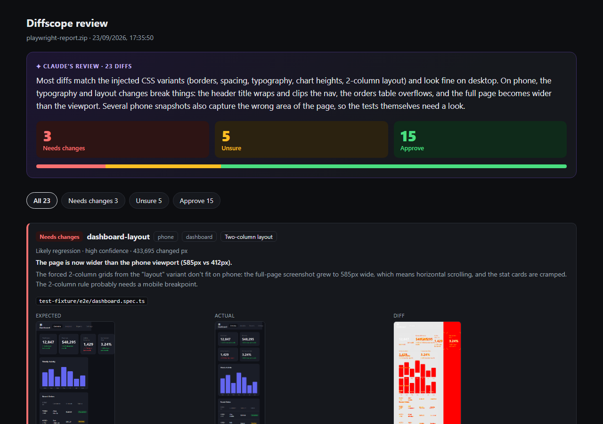

# Diffscope

**Review Playwright visual regression diffs in your browser — and let Claude pre-review them against your code changes.**

[](https://github.com/bricebdht/diffscope/releases) [](LICENSE)

**[Try it online →](https://bricebdht.github.io/diffscope/)** — click *Try with a sample report* to see a real report, already pre-reviewed by Claude.



Playwright's HTML report shows failing screenshots one test at a time. Diffscope turns them into a review queue: every diff in one grid, side-by-side comparison, approve or reject with the keyboard, and your rejected diffs kept apart for the PR comment. Everything runs in your browser: no backend, no account, nothing uploaded.

## Features

- **Import** a Playwright report folder or `.zip` archive by drag & drop — parsed client-side
- **Thumbnail grid** of all screenshot diffs, grouped by test suite, with changed pixel count and viewport
- **Comparison view**: *3-Panel* (Expected | Actual | Diff with synchronized scroll) or *Slider* overlay
- **Keyboard review**: Approve (`A`), Needs Changes (`X`), `←` / `→` between diffs, auto-advance to the next pending diff
- **Reviewed sections**: rejected and approved diffs go to separate sections, so you can find what to report on the PR
- **Filters** by suite, viewport, review status, Claude's verdict and text
- **Claude pre-review** (optional): a verdict and an explanation on every diff — see below
- **Persistent state**: review decisions are saved in your browser



## AI pre-review with Claude Code

A [Claude Code](https://claude.com/claude-code) plugin reviews every diff with Claude, using your Claude subscription (no API key). Because it runs in your repository, Claude relates each visual change to the code change that caused it, and tells you what looks intended, what looks like a regression and what is just rendering noise.

```shell
/plugin marketplace add bricebdht/diffscope
/plugin install diffscope@diffscope
/diffscope:review
```

`/diffscope:review` downloads the Playwright report of your branch's latest GitHub Actions run (or takes a local report path), then:

- opens a standalone HTML page with its conclusions, easy to share with your team;
- writes `diffscope-suggestions.json` next to the report: import it with the **Claude review** button to see its verdict on each card and its explanation in the comparison view.

Claude only suggests: you still approve or reject every diff. See [plugin/README.md](plugin/README.md) for the options and the file format.



## Getting started

Use the hosted version at **https://bricebdht.github.io/diffscope/**, or run it locally:

```bash
git clone https://github.com/bricebdht/diffscope.git
cd diffscope
npm install
npm run dev
```

Open http://localhost:5173, then import your `playwright-report` folder or `.zip` archive.

## Build for production

```bash
npm run build
npm run preview   # preview the production build locally
```

The output is in `dist/`, with relative asset paths: deploy it to any static hosting, at the root or in a subfolder. This repository deploys it to GitHub Pages on every push to `main` (`.github/workflows/deploy-pages.yml`).

## Generating a test report

A small fixture project in `test-fixture/` generates a Playwright report with visual diffs, useful for testing Diffscope itself.

```bash
cd test-fixture
npm install
npx playwright install chromium
npm run report   # playwright-report/ and playwright-report.zip
npm run demo     # rebuilds the sample report in public/demo/
```

The scripts take baseline screenshots of a sample dashboard, then re-run with injected CSS changes to produce intentional visual diffs.

## How it works

Playwright generates an HTML report (`index.html`) that embeds a ZIP archive containing `report.json` and all screenshot attachments. Diffscope parses this entirely in the browser:

1. Reads `index.html` from the imported folder or `.zip` and extracts the base64-encoded ZIP
2. Decompresses the ZIP (using pako) and parses `report.json`
3. Extracts diff, actual and expected PNG images as blob URLs
4. Counts changed pixels by decoding raw PNG data (pure JS, no canvas)

No files are uploaded anywhere — everything stays on your machine.

## Tech stack

React · Vite · TypeScript · Tailwind CSS · shadcn/ui · Zustand

## License

MIT
